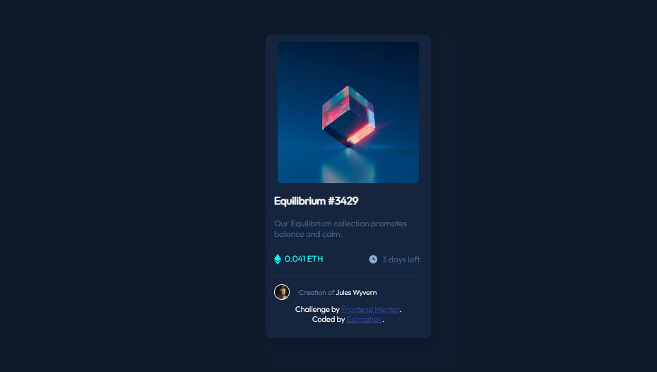

# Frontend Mentor - NFT preview card component solution

This is a solution to the [NFT preview card component challenge on Frontend Mentor](https://www.frontendmentor.io/challenges/nft-preview-card-component-SbdUL_w0U). Frontend Mentor challenges help you improve your coding skills by building realistic projects. 

## Table of contents

- [Overview](#overview)
  - [The challenge](#the-challenge)
  - [Screenshot](#screenshot)
  - [Links](#links)
- [My process](#my-process)
  - [Built with](#built-with)
  - [What I learned](#what-i-learned)
- [Author](#author)
- [Acknowledgments](#acknowledgments)

## Overview

### The challenge

Users should be able to:

- View the optimal layout depending on their device's screen size
- See hover states for interactive elements

### Screenshot



### Links

- Solution URL:(https://github.com/Esinnation/nft-preview-card)
- Live Site URL:(https://esinnation.github.io/nft-preview-card/)


## My process

### Built with

- Semantic HTML5 markup
- CSS custom properties
- Flexbox

### What I learned

Use this section to recap over some of your major learnings while working through this project. Writing these out and providing code samples of areas you want to highlight is a great way to reinforce your own knowledge.

To see how you can add code snippets, see below:

```html
<p>
            <div class="eth-container">
              
              <span class="text3">0.041 ETH</span>
            </div>
            <div class="clock-container">
              
              <span class="text4"> 3 days left</span>
            </div>
        </p>
```
```css
.container{
    background-color: hsl(216, 50%, 16%);
    flex-direction: column;
    margin: 50px 0px 50px 0px;
    border-radius: 8px;
    padding: 0px 12px 20px 12px;
    box-shadow: 10px 10px 10px 10px  hsl(217, 54%, 11%,70%),20px 20px 20px 20px hsl(216, 50%, 16%,30%);;
```


### Useful resources
- [Resource](https://www.w3schools.com) - This is an amazing website that helped me when i had problems remembering some css properties. I'd recommend it to anyone still learning this concept and anyone who need a quick recap on any concept.


## Author

- Github - [Esinnation](https://www.github.com/esinnation)
- Frontend Mentor - [@Esinnation](https://www.frontendmentor.io/profile/Esinnation)
- Twitter - [@Esinnation](https://www.twitter.com/esinnation)